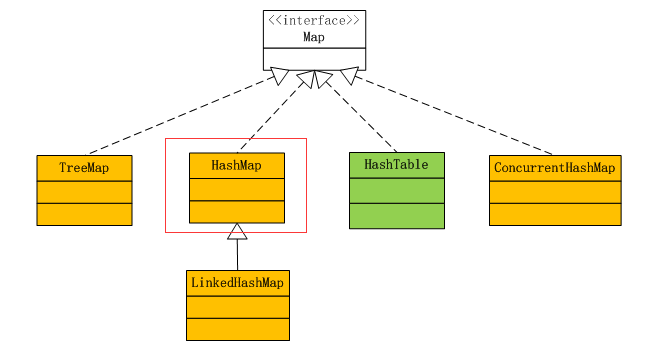
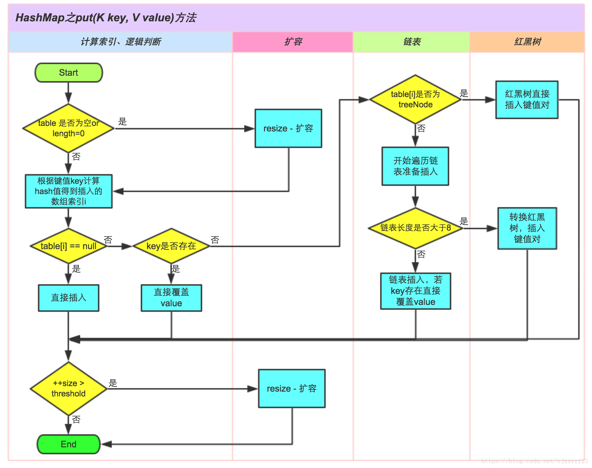

分享主题 | 分享人 | 分享时间
---|---|---
聊聊HashMap | 施亮 | 2021-07-15

## 聊聊 HashMap

## 一、介绍transient关键字

#### 1、transient
被transient修饰的变量不参与序列化和反序列化。
当一个对象被序列化的时候，transient型变量的值不包括在序列化的表示中，
然而非transient型的变量是被包括进去的。

#### 2、序列化
(1)实现Serializable接口。
(2)实现Externalizable接口。

区别:
使用Externalizable接口时，无论属性有没有被transient修饰，
默认不对任何属性进行序列化。

## 二、运算 
1、位 1<<4 
0000 0001 = 2^0 = 1
0001 0000 = 2^4 = 16

2、与运算 1&16
0000 0001
0001 0000

0000 0000 = 0

## 三、红黑树
示意图:

#### 红黑树的特性:
（1）每个节点或者是黑色，或者是红色。
（2）根节点是黑色。
（3）每个叶子节点（NIL）是黑色。 [注意：这里叶子节点，是指为空(NIL或NULL)的叶子节点！]
（4）如果一个节点是红色的，则它的子节点必须是黑色的。
（5）从一个节点到该节点的子孙节点的所有路径上包含相同数目的黑节点。

## 四、Map

#### 1、介绍MAP
示意图:

#### 2、基本属性定义
static final int DEFAULT_INITIAL_CAPACITY = 1 << 4; //HashMap中桶的数量。默认值为16
-- tableSizeFor()

static final int MAXIMUM_CAPACITY = 1 << 30;//最大容量2^30

static final float DEFAULT_LOAD_FACTOR = 0.75f;//填充比,衡量HashMap满的程度

//当add一个元素到某个位桶，其链表长度达到8时将链表转换为红黑树
static final int TREEIFY_THRESHOLD = 8;//树化阈值 8 当链表的容量超过阈值时，将链表转化为红黑树。
static final int UNTREEIFY_THRESHOLD = 6;//链表化阈值 6 当resize后或者删除操作后链表的容量低于阈值时，将红黑树转化为链表。
static final int MIN_TREEIFY_CAPACITY = 64;//最小树化容量64 hash表容量低于该容量时不会树化。

transient Node<k,v>[] table;//存储元素的数组
transient Set<map.entry<k,v>> entrySet;
transient int size;//存放元素的个数
transient int modCount;//被修改的次数
int threshold;//临界值 当实际大小(容量*填充比)超过临界值时，会进行扩容 
final float loadFactor;//填充比

#### 3、putVal方法

        final V putVal(int hash, K key, V value, boolean onlyIfAbsent,
                   boolean evict) {
        Node<K,V>[] tab; 
        Node<K,V> p; 
        int n, i;
        if ((tab = table) == null || (n = tab.length) == 0)
#### 开始会初始化大小为16的数组
            n = (tab = resize()).length;
#### 当前数组的长度减1与运算key的hash值，下个node是不是null            
        if ((p = tab[i = (n - 1) & hash]) == null)
#### 当前桶无元素
            tab[i] = newNode(hash, key, value, null);
        else {
            Node<K,V> e; K k;
            if (p.hash == hash &&
                ((k = p.key) == key || (key != null && key.equals(k))))
#### 桶内元素的key等于待放入的key
                e = p;
            else if (p instanceof TreeNode)
####  如果此时桶内已经树化
                e = ((TreeNode<K,V>)p).putTreeVal(this, tab, hash, key, value);
            else {
#### 桶内还是一个链表，则插入链尾（尾插）
                for (int binCount = 0; ; ++binCount) {
                    if ((e = p.next) == null) {
                        p.next = newNode(hash, key, value, null);
                        if (binCount >= TREEIFY_THRESHOLD - 1) // -1 for 1st
####  变成红黑树
                            treeifyBin(tab, hash);
                        break;
                    }
#### 如果有相同的key值就结束遍历
                    if (e.hash == hash &&
                        ((k = e.key) == key || (key != null && key.equals(k))))
                        break;
                    p = e;
                }
            }
#### 链表上有相同的key值 
            if (e != null) { // existing mapping for key
                V oldValue = e.value;
                if (!onlyIfAbsent || oldValue == null)
                    e.value = value;
                afterNodeAccess(e);
                return oldValue;
            }
        }
#### 检查是否应该扩容
        ++modCount;
        if (++size > threshold)
            resize();
        afterNodeInsertion(evict);
        return null;
    }

#### 2、流程图

