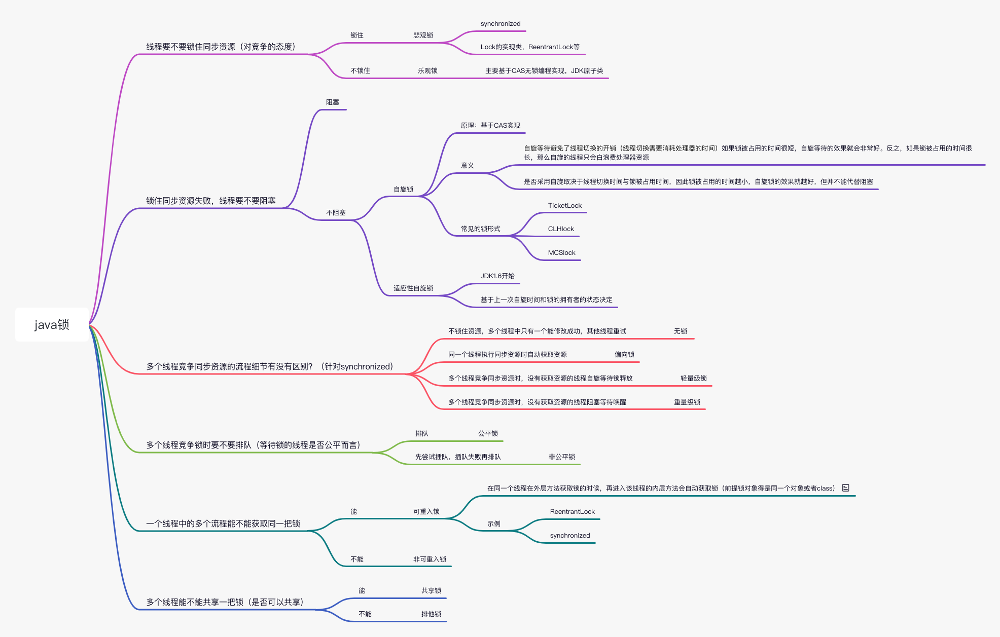

# Java中的"锁"事
# 编写思路
通过volatile介绍cpu缓存模型、可见性及指令重拍 --> 引出是否能够保证线程安全 ---> 不能，引出 "锁" 
---> 锁的分类 ---> synchronized ---> AQS（api实现的锁的鼻祖）

## volatile关键字
volatile轻量级的同步关键字
- 1、保证可见性：保证volatile变量的所有读取都是直接从主存读取，所有写入都是直接写入到主存中。
- 2、保证有序性：禁止指令重排序。

### CPU缓存模型
在一个多线程的应用中，线程在操作非volatile变量时，出于性能考虑，每个线程可能会将变量从主存拷贝到CPU缓存（**工作内存**）中。如果你的计算机有多个CPU，每个线程可能会在不同的CPU中运行。这意味着，每个线程都有可能会把变量拷贝到各自CPU的缓存中，如下图所示：

### 可见性
Java的volatile关键字就是设计用来解决变量可见性问题。将变量声明为volatile，则在写入变量时，也会同时将变量值写入到主存中。同样的，在读取counter变量值时，也会直接从主存中读取。
> 可以将对volatile变量的读写理解为一个触发刷新的操作，写入volatile变量时，线程中的所有变量也都会触发写入主存。而读取volatile变量时，也同样会触发线程中所有变量从主存中重新读取。因此，应当尽量将volatile的写入操作放在最后，而将volatile的读取放在最前

### happens-before(先行发生规则)
- **程序次序规则**：在一个线程内，按照程序代码顺序，书写在前面的操作先行发生于书写在后面的操作。准确地说，应该是控制流顺序而不是程序代码顺序，因为要考虑分支、循环等结构。
- **管程锁定**：一个unlock操作先行发生于后面对同一个锁的lock操作。这里必须强调的是同一个锁，而“后面”是指时间上的先后顺序。
- **volatile变量规则**：对一个volatile变量的写操作先行发生于后面对这个变量的读操作，这里的“后面”同样是指时间上的先后顺序。
- **线程启动规则**：线程中的所有操作都先行发生于对此线程的终止检测，我们可以通过Thread.join()方法结束、Thread.isAlive()的返回值等手段检测到线程已经终止执行。
- **线程中断规则**：对线程interrupt()方法的调用先行发生于被中断线程的代码检测到中断事件的发生，可以通过Thread.interrupt()方法检测到是否有中断发生。
- **对象终结原则**：一个对象的初始化完成（构造函数执行结束）先行发生于它的finalize()方法的开始。
- **传递性**：如果操作A先行发生于操作B，操作B先行发生于操作C，那就可以得出操作A先行发生于操作C的结论。

### 指令重拍
大多数现代微处理器都会采用将指令乱序执行（out-of-order execution，简称OoOE或OOE）的方法，在条件允许的情况下，直接运行当前有能力立即执行的后续指令，避开获取下一条指令所需数据时造成的等待3。通过乱序执行的技术，处理器可以大大提高执行效率。

### Question
- volatile可以线程安全吗？

## 常见用法
- volatile + synchronized / CAS
    - AtomicInteger源码

## 锁的分类

## synchronized
- synchronized是java语言的关键字，原生语法层面的互斥锁，基于jvm实现。
- synchronized通过Monitor来实现线程同步，Monitor是依赖于底层的操作系统的Mutex Lock（互斥锁）来实现的线程同步
> jdk1.5之后通过锁升级的方式进行了相关优化（无锁 ——> 偏向锁 ——> 轻量级锁 ——> 重量级锁）
### 升级过程

> - 一个对象刚开始实例化的时候，没有任何线程来访问它的时候。它是可偏向的，意味着，它现在认为只可能有一个线程来访问它，所以当第一个线程来访问它的时候，它会偏向这个线程，此时，对象持有**偏向锁**。偏向第一个线程，这个线程在修改对象头成为偏向锁的时候使用CAS操作，并将对象头（Mark Word）中的ThreadID改成自己的ID，之后再次访问这个对象时，只需要对比ID，不需要再使用CAS在进行操作
> - 一旦有第二个线程访问这个对象，因为偏向锁不会主动释放，所以第二个线程可以看到对象时偏向状态，这时表明在这个对象上已经存在竞争了，检查原来持有该对象锁的线程是否依然存活，如果挂了，则可以将对象变为无锁状态，然后重新偏向新的线程，如果原来的线程依然存活，则马上执行那个线程的操作栈，检查该对象的使用情况，如果仍然需要持有偏向锁，则偏向锁升级为**轻量级锁**，（偏向锁就是这个时候升级为轻量级锁的）。如果不存在使用了，则可以将对象回复成无锁状态，然后重新偏向。
> - **轻量级锁**认为竞争存在，但是竞争的程度很轻，一般两个线程对于同一个锁的操作都会错开，或者说稍微等待一下（自旋），另一个线程就会释放锁。 但是当自旋超过一定的次数，或者一个线程在持有锁，一个在自旋，又有第三个来访时，轻量级锁膨胀为**重量级锁**，重量级锁使除了拥有锁的线程以外的线程都阻塞，防止CPU空转。

## AQS(AbstractQueuedSynchronizer)
> 抽象队列同步器

### ReentrantLock
属于api层面实现的

## Reference